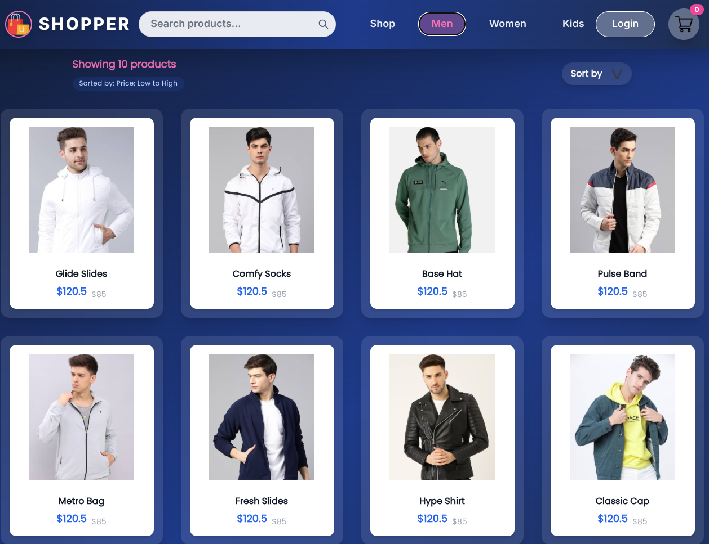
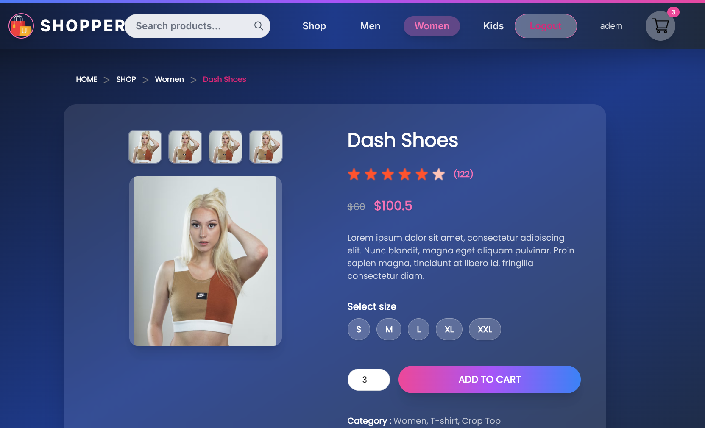
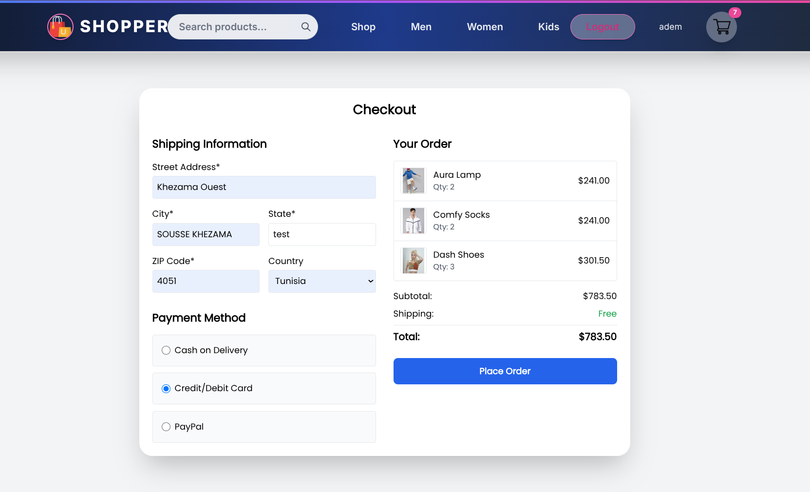
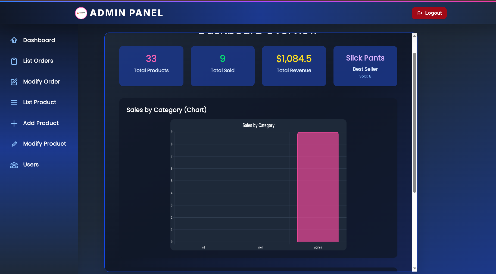
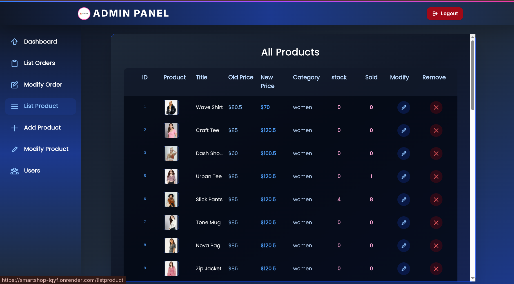
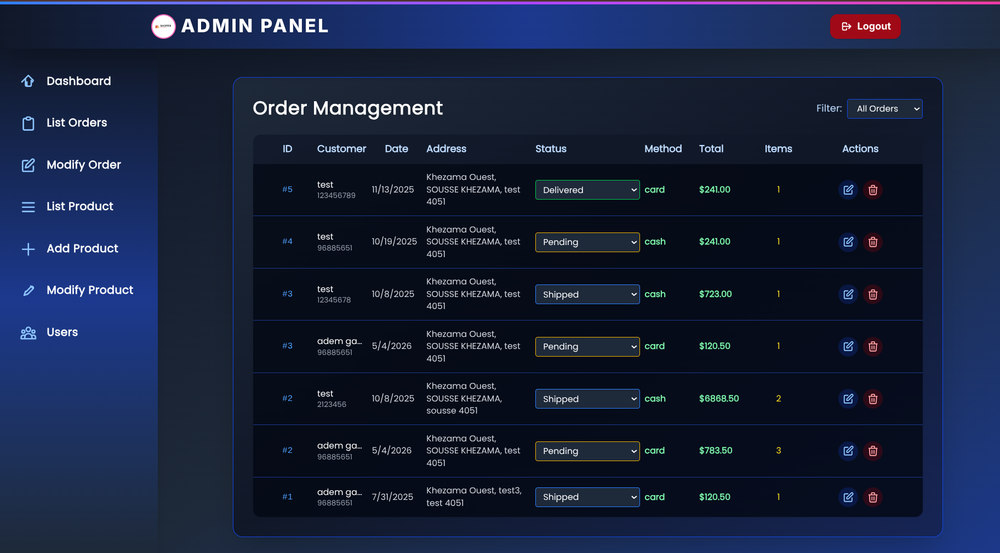
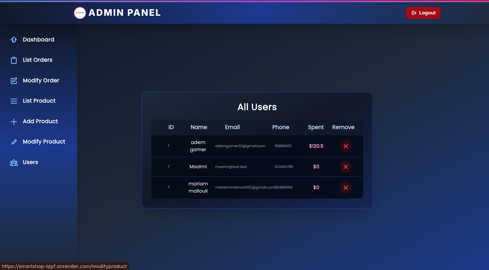

# SmartShop — Full-Stack E-Commerce Platform

Live demo: https://smartshop-lqyf.onrender.com

A complete e-commerce application with customer-facing storefront, 
shopping cart, authentication, and a separate admin dashboard.

## Features
- User authentication (JWT)
- Product browsing, search, and cart management  
- Admin panel: add/remove products, image upload, order overview
- Separate frontend, admin, and backend architecture

## Tech Stack
- **Frontend:** React
- **Admin:** React + Vite  
- **Backend:** Node.js, Express, MongoDB
- **Auth:** JWT

## Screenshots

